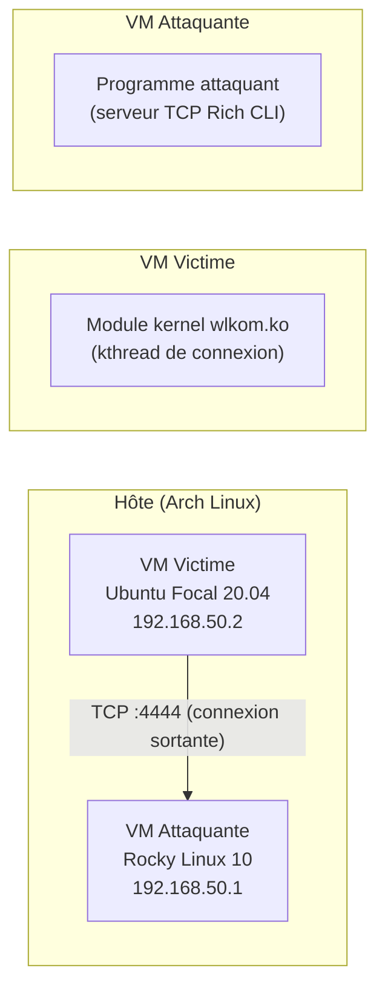

# WLKOM

Documentation fonctionnelle de **wlkom-rootkit**, un rootkit Linux pédagogique écrit en module kernel, construit pour apprendre par la pratique comment un système se laisse prendre.

---

## Consulter cette documentation

Depuis la racine du projet :

```sh
# Servir en local avec rechargement automatique
make docs-serve
# → http://127.0.0.1:8000

# Générer le site statique (dans docs/build/)
make docs
```

---

## Démarrage rapide

Si c'est votre première utilisation, suivez ces étapes dans l'ordre :

1. [Vérifier les prérequis](pages/prerequisites/prerequisites.md) : installer les outils système et activer KVM
2. [Lancer la VM attaquante](pages/setup/attacking-vm.md) : démarre le serveur de contrôle (Rocky Linux)
3. [Lancer la VM victime](pages/setup/victim-vm.md) : démarre la cible (Ubuntu Focal)
4. [Lancer le programme attaquant](pages/setup/attacking-vm.md#programme-attaquant) : `rootkit` dans la VM attaquante (premier lancement : configure le mot de passe et la clé XOR)
5. [Compiler et charger le rootkit](pages/setup/rootkit.md) : `make module && sudo insmod wlkom.ko` dans la VM victime
6. [S'authentifier](pages/usage/connection.md#authentification) : `AUTH wlkom` dans l'interface

---

## Architecture



Le rootkit tourne côté **victime** et se connecte de lui-même au programme attaquant. En cas de déconnexion, il retente automatiquement toutes les 3 secondes.

---

## Fonctionnalités

| Fonctionnalité | Documentation |
| :------------- | :------------ |
| Connexion persistante avec reconnexion | [→](pages/usage/connection.md) |
| Persistance au redémarrage | [→](pages/features/persistence.md) |
| Exécution de commandes (stdout, stderr, code de sortie) | [→](pages/usage/commands.md) |
| Authentification par mot de passe | [→](pages/features/password.md) |
| Dissimulation du module | [→](pages/features/hide-module.md) |
| Dissimulation d'une ligne dans un fichier | [→](pages/features/hide-line.md) |
| Chiffrement XOR des communications | [→](pages/features/cipher.md) |
