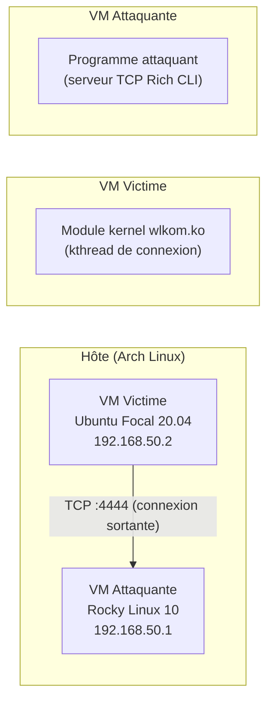

# Connexion

La connexion entre le rootkit et le programme attaquant est **initiée par le rootkit** (connexion sortante depuis la victime).

---

## Schéma



---

## Comportement du rootkit

### Connexion initiale

Au chargement du module (`sudo insmod wlkom.ko`), un kthread (`wlkom_connection`) est démarré. Il tente immédiatement de se connecter à `server_ip:server_port` (défauts : `192.168.50.1:4444`).

### Reconnexion automatique

Si la connexion échoue ou est perdue, le rootkit attend **3 secondes** puis retente indéfiniment, jusqu'à succès ou déchargement du module. Vous n'avez pas besoin de recharger le module si la connexion est interrompue.

---

## Comportement du programme attaquant

Le serveur écoute sur `0.0.0.0:4444` dès le lancement. Quand un rootkit se connecte :

- Le statut passe à 🟢 **CONNECTED**
- Un log `[CONNECTED] <ip>:<port>` apparaît
- La bordure du panneau passe au vert

En cas de déconnexion :

- Le statut passe à 🔴 **DISCONNECTED** (et 🔓 **NOT AUTHENTICATED**)
- Un log `[DISCONNECTED] <ip>:<port>` apparaît
- La bordure repasse au rouge

---

## Authentification

Après connexion, le rootkit n'est pas encore authentifié. Les commandes nécessitant une authentification répondent `ERR unauthorized` tant que `AUTH` n'a pas été envoyé avec succès.

Pour s'authentifier, tapez dans le champ de saisie du programme attaquant :

```
AUTH wlkom
```

Si le mot de passe est correct :

```
OK authenticated
```

Le statut passe alors à 🔐 **AUTHENTICATED** et les commandes avancées deviennent disponibles.

!!! warning "Ré-authentification après déconnexion"
Si le rootkit se déconnecte et se reconnecte (ex. après un `QUIT` ou un redémarrage de la VM victime), la session repart de zéro : il faut envoyer `AUTH` à nouveau.

---

??? note "Détails techniques"

    ### Hash côté rootkit

    Le mot de passe est vérifié par un hash **djb2** (`0x10a572ef`) dans le kernel (`wlkom_hash()`). C'est un hash simple, non cryptographique. Voir [Authentification](../features/password.md) pour les détails du système de mot de passe.

    ### Chiffrement du canal

    Toutes les données échangées (commandes et réponses) sont XOR-obfusquées avec la clé pré-partagée. Le trafic est donc illisible en clair dans un dump réseau. Voir [Chiffrement](../features/cipher.md) pour les détails.

    ### Taille du buffer

    Le buffer de réception du rootkit est limité à **256 octets** par message. Les commandes dépassant cette taille seront tronquées.

    ```c
    #define WLKOM_BUFFER_SIZE 256
    ```

    ### Polling

    Le rootkit utilise `MSG_DONTWAIT` pour lire les données sans bloquer, avec un délai de polling de **200 ms**.

    ```c
    #define WLKOM_POLL_DELAY 200  // ms
    ```
